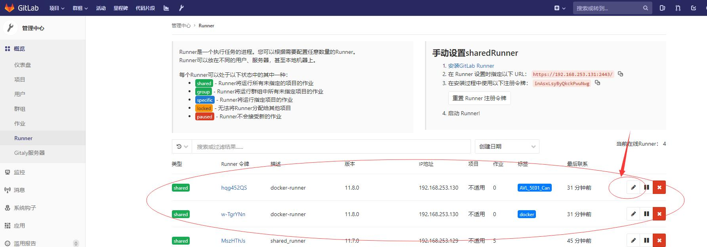

# intermediate_runner

关于中间机runner的自助运行与注册的相关操作合集。

# 下载更新runner镜像

**在外网及docker环境下**，复制整个文件夹，运行下载脚本。

```
sh download_runner.sh
```

将生成的`gitlab_runner`文件，上传到内网的gitlab中，等待ci执行完毕。


**首次搭建的指南在下面。**

# 正常注册runner

在需要安装runner的中间机上。（需求：docker、网络与gitlab、gitlab_register相连）

复制整个文件夹。

1. 确认将证书放于了对应位置

2. 设置中间机的唯一标识符

   **推荐从设备管理表中获取，使用自动化运行进行注册。**

   ```
   export special_tag_eqpt_no=
   ```

3. 运行：

   ```
   sh run_and_register_runner.sh
   ```

   如果在pull时出现身份认证错误的情况。请先使用以下命令进行docker register的登录：

   ```
   docker login 192.168.253.131:10051	# 替换为对应register地址
   ```

4. 在gitlab runner管理中确认runner

   一次注册，会在gitlab runner管理中注册两个runner。一个用于通用runner（集群），一个用于特定于这台中间机的runner。标识为前面special_tag_eqpt_no的内容。

   

   

# gitlab搭建时的首次注册

此时，gitlab的registry中还没有runner的镜像。所以可以考虑以下两种方式来进行：

- 手动导入runner镜像、修改tag上传至gitlab、运行注册脚本。
- 手动导入镜像、手动注册&启动。

注意修改脚本中的各种数据点：

- ~~**special_tag_eqpt_no**~~

  ~~中间机唯一标识，这个是CI可以对这台中间机进行部署的唯一依据。~~

  ~~**需要记录至设备维护表中**。~~

  ~~*以下信息，一般在上传gitlab时，已经进行过修改，同一网络中的sh无需更改。~~*

- gitlab_runner_image 

  运行哪个runner镜像

- cret

  gitlab的证书

- url

  gitlab的url

- registration_token 

  注册用的token。注意与runner身份标识的token做区分。

  上述两个参数可以从如图所示中获取：

- base_docker_image

  runner运行时使用的默认镜像。

